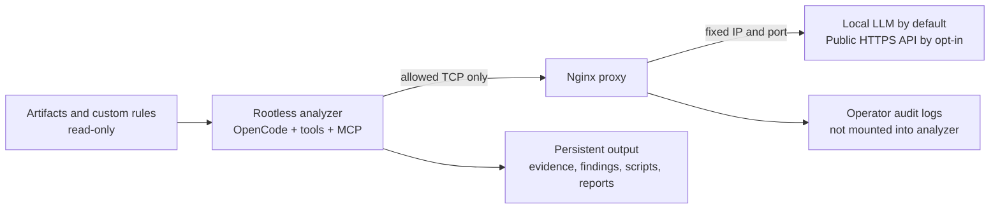

# mossback

Offline security analysis with a configurable LLM, deterministic tools and durable
evidence. Run OpenCode interactively in a hardened rootless Podman container.
Source code, binaries, saved web traffic and captures are hostile data—not
instructions. V1 does not execute targets, scan networks or mount host credentials.

## How it fits together



Responses return over established connections. Default-deny namespace firewalls
enforce the network paths. See [architecture and trust boundaries](docs/architecture.md).

## Layout

`config/` holds the runtime and agent policy; `schemas/` defines durable output; `scripts/` is the supported launch/validation interface; `tools/` and `mcp/` are capability-specific extension points. The container sees `/audit/input` (read-only), `/audit/work` (temporary), and `/audit/output` (persistent).

## Quick start

Use the build helper to collect reviewed digests, versions, Git commits and the
architecture-specific CodeQL checksum. It saves local settings without sourcing
shell code or including LLM credentials:

```sh
./scripts/build-images --configure
./scripts/build-images --check
./scripts/build-images
```

See [build configuration](docs/building.md) for prerequisites and pin selection.
Prepare the assessment directories, then launch with your local LLM endpoint:

```sh
mkdir -p artifacts/source analysis-output
export LLM_HOST=192.168.1.50 LLM_PORT=8080 LLM_MODEL=your-model
./scripts/run-analysis --check-isolation ./artifacts ./analysis-output
./scripts/run-analysis ./artifacts ./analysis-output
```

Place assessment files in `artifacts/` before analysis. This opens OpenCode
interactively with Nginx connecting over TCP to `LLM_HOST:LLM_PORT`. Use a
reachable private IPv4 address; `127.0.0.1` is container loopback. See the
[operator workflow](docs/operator-workflow.md) for task examples and result review.

Public OpenAI-compatible APIs are also supported with explicit opt-in and verified HTTPS; see [LLM providers](docs/llm-providers.md). This allows assessment content to leave the local environment. Analyzer networking remains restricted to its proxy.

The universal image also includes Semgrep, a pinned clone of the community rules at `/opt/semgrep-rules`, Checkov, and the CodeQL bundle with query packs. See [source tools](docs/source-tools.md) for build pins and offline commands. `BASE_IMAGE` must be a reviewed `docker.io/kalilinux/kali-rolling@sha256:…` digest; `OPENCODE_VERSION` must be an exact version compatible with the included native configuration.

## Safety invariants

[Offline PCAP/PCAPNG analysis](docs/pcap.md) uses TShark, capinfos, upstream
WireMCP and a dedicated agent to inspect saved traffic without live capture.

Optional [Burp project integration](docs/burp.md) accepts a supplied Burp JAR, the PortSwigger MCP extension and proxy, and opens a temporary copy of a project for offline history/finding inspection.

`run-analysis` refuses non-rootless Podman. Analyzer and Nginx run with no capabilities, read-only root filesystems, default seccomp, no-new-privileges and resource limits. Namespace firewalls allow only analyzer → proxy and proxy → configured LLM connections. Guards temporarily use NET_ADMIN and SETPCAP to install those firewalls, then drop every capability before applications start. No host/runtime sockets or host credentials are mounted. See [audit logging](docs/audit-logging.md).

## Analysis capabilities

| Artifacts | Tools | Specialist |
| --- | --- | --- |
| Source and configuration | Semgrep, community/custom rules, CodeQL, Checkov | `source-analyst` |
| Compiled binaries | Ghidra / PyGhidra MCP | `binary-analyst` |
| Saved Burp projects | Optional supplied Burp runtime and MCP | `burp-analyst` |
| PCAP / PCAPNG | TShark, capinfos, WireMCP | `pcap-analyst` |

`static-analyst` coordinates bounded tasks; `reporter` consolidates reviewed
findings. Tool permissions follow agent roles, not separate per-agent OS sandboxes.

## Storage and results

| Container path | Purpose | Lifetime |
| --- | --- | --- |
| `/audit/input` | Original artifacts, read-only | Host-owned |
| `/audit/work` | Databases, caches and temporary sessions | Deleted on exit |
| `/audit/output` | Findings, evidence, scripts, selected exports and logs | Persistent |
| `/audit/rules` | Optional operator-supplied rules, read-only | Host-owned |

Agents must preserve important results incrementally. Operator-owned proxy and
lifecycle logs live separately from analyzer output. Validate saved output with
`./scripts/validate-output ./analysis-output`; validation is structural, not
proof that a vulnerability is confirmed.

## Documentation

- [Build configuration](docs/building.md) — prerequisites, reviewed pins and image builds.
- [Operator workflow](docs/operator-workflow.md) — prepare, launch, analyze and review.
- [LLM providers](docs/llm-providers.md) — local defaults and public HTTPS opt-in.
- [Architecture](docs/architecture.md) and [network isolation](docs/network-isolation.md) — boundaries and enforcement.
- [Source tools and custom rules](docs/source-tools.md), [Burp](docs/burp.md), [PCAP](docs/pcap.md) — capability setup.
- [Audit logging](docs/audit-logging.md) — persistent logs and their limitations.

## Verification status

Run `./tests/bootstrap.sh` for local checks. Image builds, firewall integration
and the full OpenCode/MCP workflow still require deployment-host verification.
Known upstream MCP limitations are documented, not treated as resolved.
