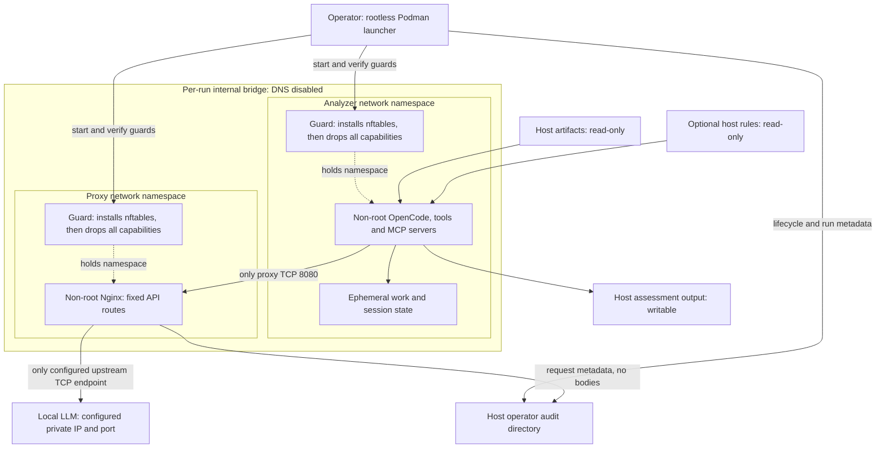

# Architecture and trust boundaries

mossback combines one universal analysis image with a small LLM proxy image.
The LLM runs outside both containers on an operator-controlled private endpoint.

## Runtime boundary

The proxy namespace also joins an egress bridge; its firewall permits only
the configured LLM endpoint. Both applications use read-only root filesystems,
no capabilities, no-new-privileges and resource limits. Loopback and established
responses are allowed. Guard failure aborts startup, with no permissive fallback.
See [network isolation](network-isolation.md) for routes, credentials and TLS.

## Agent roles are permissions, not containers

All specialist agents and MCP processes share the analyzer's OS boundary.
OpenCode permissions limit which tools each role can call; they do not sandbox
one agent's writable files from another. Shell approvals are required for
source and PCAP tool commands; other roles have narrower access.

Artifact contents and tool results never authorize new actions. Even saved
evidence, scripts and manifests remain untrusted data. Upstream WireMCP is
unmodified and retains its known shell/path risks; see [PCAP analysis](pcap.md).

## What survives a run

Input artifacts are never modified. Temporary databases and application session
state disappear with the container. Agents preserve intentional findings,
evidence, scripts, selected artifacts and manifests in output incrementally.
This does not provide full session resumability or guaranteed automatic exports.

Operator audit logs are not mounted into the analyzer. Analyzer logs and agent
journals are useful but writable and not tamper-proof. See [audit logging](audit-logging.md).

## Deployment checks

Unit tests cover selected policy, command and filesystem behavior. Before relying
on the boundary, validate image builds, namespace nftables, proxy egress, actual
OpenCode permission enforcement and each selected MCP distribution on the host.
